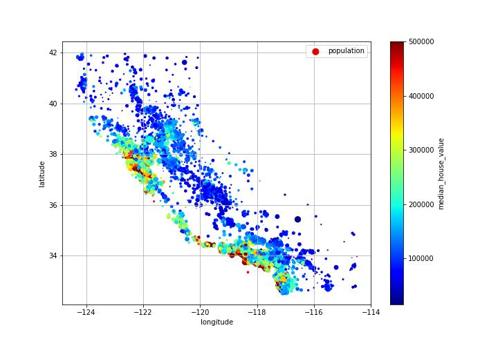
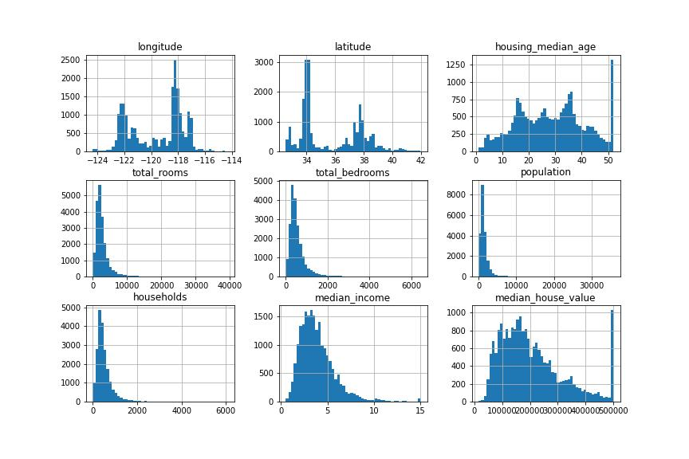
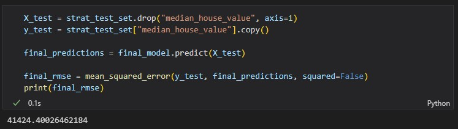

# Python Housing Prices

This project was developed to aid in collecting, interpreting and analyzing data for a construction project. The goal of the project was to find a pattern in the data that reflects the amount of rental housing compared to median income and housing prices in U.S. districts.

## Data Acquisition

The project began with the issue of downloading the data. The data was downloaded using the Requests library to download the tgz file and the Tarfile library to extract and read the file. The results of the data were stored in a Pandas DataFrame.

## Preparing the Data for Machine Learning

To prepare the data for machine learning, we began with a preliminary inspection of the data. This allowed us to view the structure of the data and get an idea of the sets of numerical and categorical variables.

After inspecting the data, we created a test set to perform tests and evaluate the performance of our machine learning model. The creation of the test set was done with the train_test_split function of scikit-learn.

## Data Discovery and Visualization

We discovered and visualized the data to gain a better understanding of it. This was achieved by using the plotting function to visualize the geographical data, the scatter_matrix function to explore the relationship between the different numerical variables and the plot function to view the relationships between the numerical variables and the average house value.

## Pre-process the Data for Machine Learning Algorithms

We then proceeded to pre-process the data for the machine learning algorithms. This was done through data cleaning, which was implemented with a SimpleImputer of scikit-learn, encoding of categorical variables with OneHotEncoder, scaling of numerical variables with StandardScaler and the creation of custom functions through FunctionsTransformer and ClusterSimilarity.

## Training the Model

Finally, we trained the linear regression model with the training set and the average house value as the target variable. We also used TransformedTargetRegressor to scale the target before training.

## Summary

In summary, this was a project to collect, interpret and analyze data that reflects the amount of rental housing and housing supply compared to median income and housing prices in U.S. districts. We used various scikit-learn tools to clean, encode, scale and train the linear regression model. An extensive parameter search was used which resulted in the model being trained with an RMSE of 40,000 on the test set. This is considered to be a good result, considering the range of values from the dataset range between 120,000 and 200,000. Next, the improved model was evaluated on the test set to obtain the final results and was saved for future use.